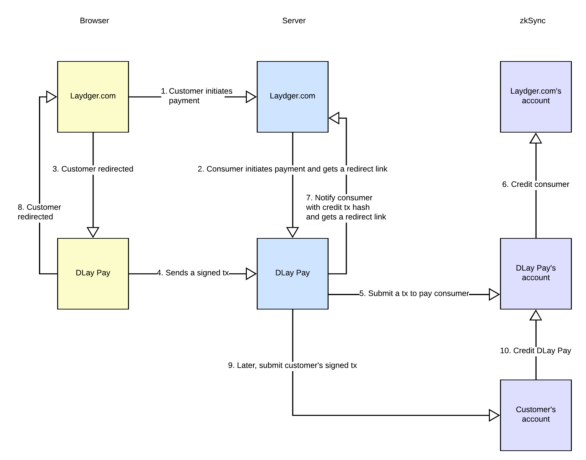
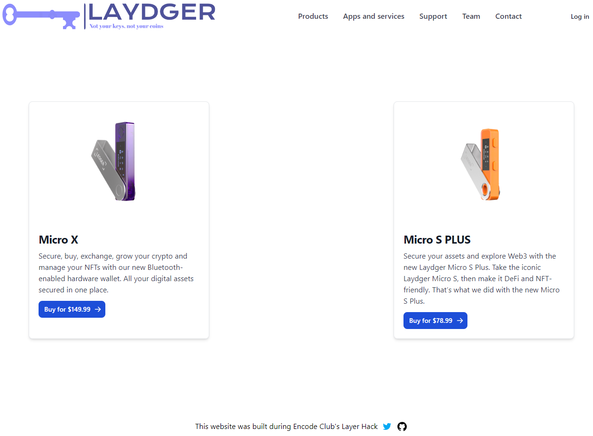
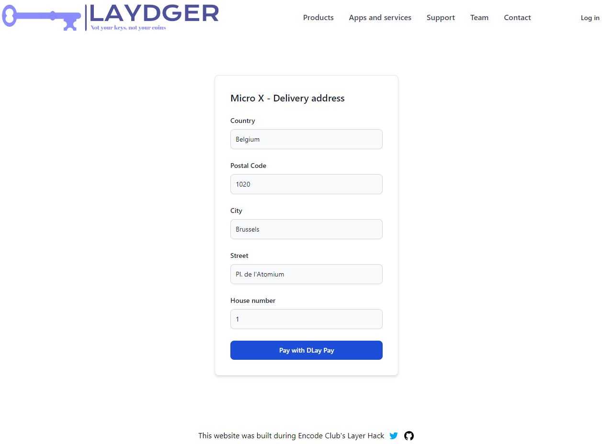
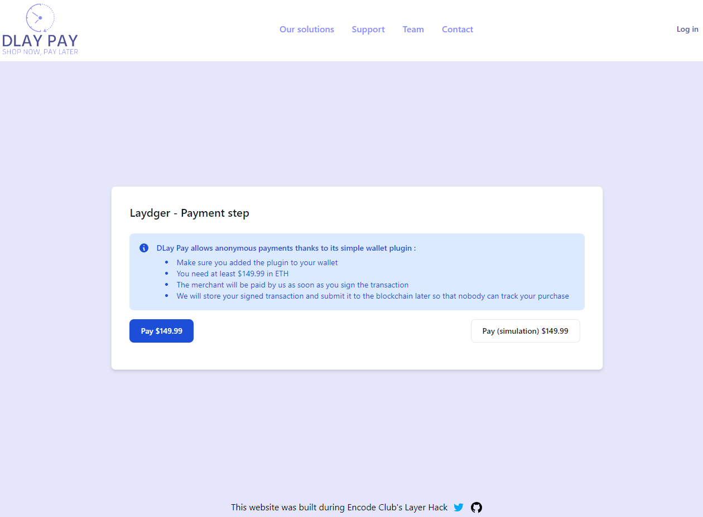
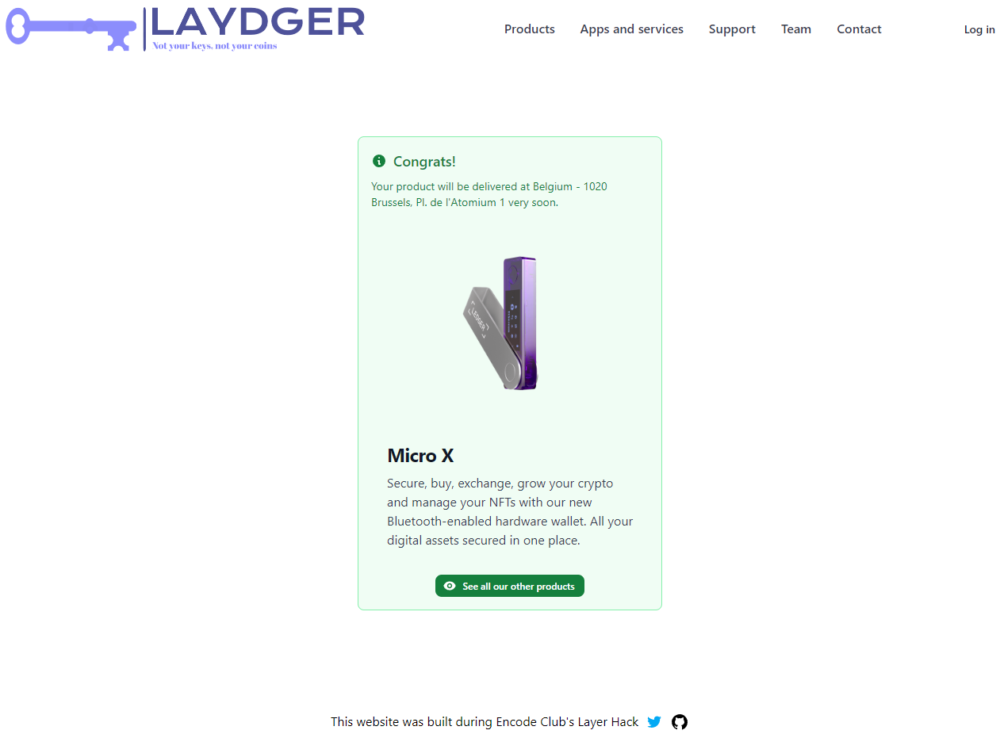

# DLay Pay server

### Summary
DLay Pay is a service that allows online stores (= consumers) to offer **anonymous payments**.
It asks the customer to sign a purchase transaction with `to` field defined as the address of DLay Pay and does not immediately submit it to zkSync's network.
Besides, the `to` field is set to DLay Pay's address.

It stores the signed transaction and signs and then submits a similar transaction but this time with the consumer's address as `to` field.

This way, **sensitive information** (name, email, delivery address, etc.) **aren't linked to the customer main address**.

[Laydger.store](https://laydger.store) is a consumer built for demonstration purposes.

### Other repositories created during the hackathon
- [dlay-pay-client](https://github.com/ootsun/dlay-pay-client)
- [laydger-client](https://github.com/ootsun/laydger-client)
- [laydger-server](https://github.com/ootsun/laydger-server)

### Description
To obfuscate the consumer transaction, DLay Pay submits it to zkSync after an indeterministic period.
The whole process can be described in 10 steps :

1. The customer initiates a payment on the consumer's website
2. Its server contacts the DLay Pay server with this information : paymentId, merchantId, amountInWei, callbackUrl and addressToCredit. The response contains a redirection link pointing to the DLay Pay website.
3. The consumer redirects the customer
4. He connects his wallet and signs a transaction. The recipient of the transaction is the address of DLay Pay.
The signed transaction is not submitted to zkSync. Instead, it is sent to the DLay Pay server
5. The server signs and submits a similar transaction whose recipient is the consumer's address
6. The consumer's account is credited
7. The server notifies the consumer's server of the event with the transaction hash. The consumer's server checks that the transaction is valid and then responds with a redirection url pointing to its own website.
8. The customer is redirected and the payment is successful!
9. Later, the DLay Pay server submits the signed customer transaction to zkSync
10. DLay Pay's account is credited

#### Benefits :
- In case of malicious actions or hacks, neither the consumer nor DLay Pay are able to link the customer's sensitive information (name, email, delivery address...) to his main wallet address
- The consumer can delegate the most dangerous part of the payment process (the management of the private key) to an external service and store its private key in a cold wallet
- DLay Pay supports the volatility of the zKSync fee market

#### Disadvantages :
- DLay Pay charges a fee
- The consumer misses the opportunity to analyze its customer's wallet. Privacy is preserved.

#### Areas for improvement
- The customer could spend all his funds before DLay Pay submits the signed transaction. To prevent this, a wallet plugin could be built.
The plugin would act as a 2 of 2 multisig between the customer and DLay Pay. By default, DLay Pay approves all transaction.
But if DLay Pay detects that the customer is moving funds that are needed for his purchase, the transaction wouldn't be approved.
If DLay Pay goes rogue and censors the customer, a 1-hour countdown may begin. Once the time limit has passed, the plugin would be uninstalled.
But this way, DLay Pay can always detect an uninstallation and submit a possible transaction.
- DLay Pay could use a Pay Master to allow the customer to pay with the token of his choice
- Using the Sismo Protocol, the customer could mint a ZK badge on his public wallet address attesting that he is the one who made the payment. A use case for this badge would be to allow customers to shop without email/password authentication.
- DLay Pay could send the money to the consumer minus a random difference (between 0.1 and 1%) to further obfuscate the transaction

#### Not implemented yet
Steps 4, 9 and 10 are currently not executed because some components are missing : 
- The wallet plugin
- Asking the customer to sign a transaction (signer.signTransaction() returns "Error: signing transactions is unsupported")
Many security checks still need to be put in place too.

### Screenshots
#### Steps 1, 2 and 3

#### Steps 4, 5, 6, 7 and 8

#### Successful payment

### Hosted at
[dlay-pay.xyz](https://dlay-pay.xyz)

### Author
This project was developed by [OoTsun](https://twitter.com/Oo_Tsun).
